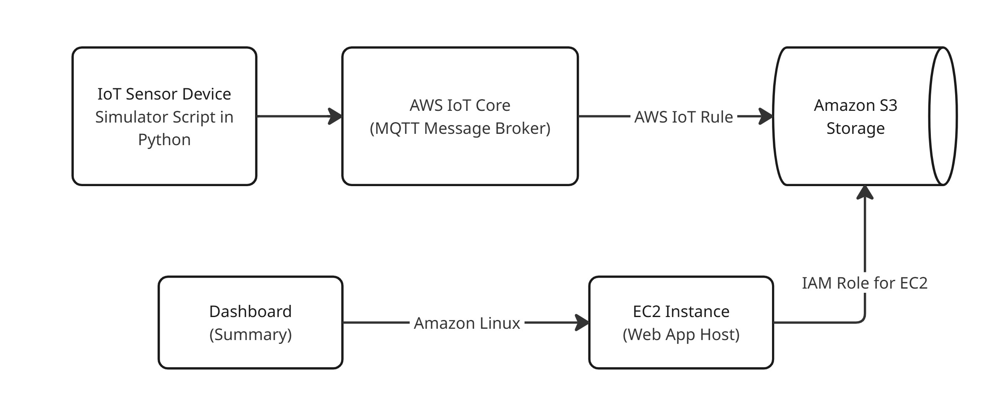

# AWS-IoT-data-processing-Model
Model pipeline for simulating the reception and processing of IoT sensor end-device data to an S3 Bucket via AWS-IoT Core (MQTT message) cloud service. Visualization conducted using streamlit dashboard hosted on EC2.

# PIPELINE
1. **IoT Sensor Device Simulator (Publisher)** to simulate multiple IoT sensor devices that would publish real-time readings to AWS IoT Core.
2. **AWS IoT Core** serving as secure gateway and broker for MQTT messages. Enforced via X.509 certificates for device authentication.
3. **Amazon S3 (Storage Layer)** stores raw sensor readings as `.json` files. Comprises IAM Role-based access for dashboard EC2 instance.
4. **Amazon EC2 Instance (Web App Hosting)** Amazon Linux (t3.micro) hosts the dashboard as a public web-app using Streamlit.
5. **Web Dashboard Frontend (Dashboard and Explainability)** parses `.json` files from S3 storage and displays most recent device readings. Aggregates and averages sensor readings across all devices.

# FUTURE WORKS
- Introduce environment variables for API key referencing.
- Write CI/CD and testing pipelines.
- Containerize.
